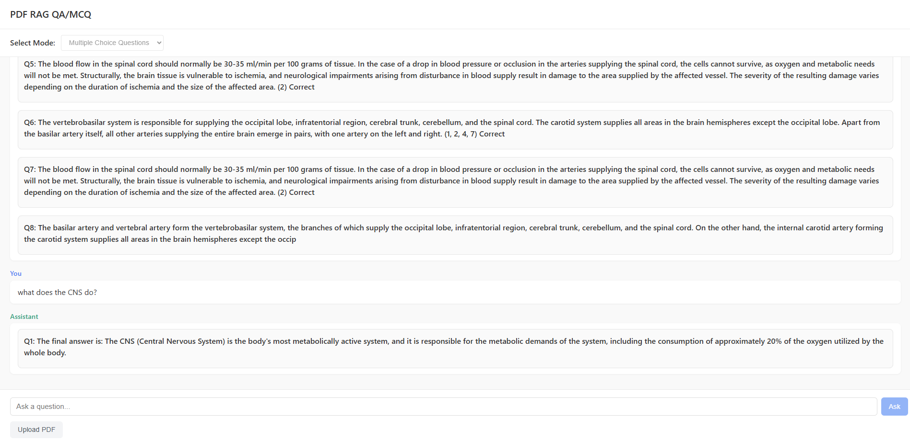

````markdown
# Retrieval Augmented Generation (RAG) Question Answering System



This project provides a simple interface to run RAG question answering and MCQ generation system.

---

## 📦 Requirements

- [Visual Studio Code](https://code.visualstudio.com/)  
- [python](https://www.python.org/) (v3.10+ recommended)
- [Node.js](https://nodejs.org/) (v18+ recommended)  

---

## 📂 Setup Instructions

1. **Clone this repository**
   ```bash
   git clone https://github.com/mr-ahabib/RAG_MCQ_QA.git
   cd RAG_MCQ_QA
````

2. **Package Installation**

   * Install the required packages: pip install -r requirements.txt
   * Install the required node packages: npm install

---

## ✅ Run Commands

* uvicorn app.main:app --reload
* npm start

---


